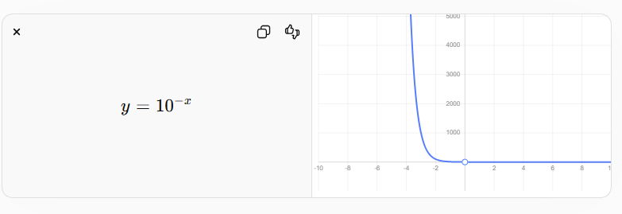

Trong Machine Learning, Binary Cross Entropy dùng Log để biến phép nhân xác suất thành phép cộng, tạo mức phạt khổng lồ khi dự đoán sai lệch lớn, và đo lường chính xác lượng thông tin theo lý thuyết thông tin

Probability(p)
Loss = l

Loss = -y log(p) - (1-y) log(1-p)

2^3 = 8
Base ( cơ số ) = 2
Exponent ( mũ ) = 3
Result = 8

Log(1) = 0 => Mọi số mũ 0 đều = 1
* Log(0) không tồn tại mà tiến tới -∞ => -Log(0) = +∞

-loss = -log(P) => Loss sẽ tiến về +∞

ví dụ: 10^(-100000) = 1/(10^100000)

Bài toán tương quan:
- Model dự đoán Probability = 1 => Loss = 0
- Model dự đoán Probability = 0 => Loss = +∞

        ------------------------------
        | Probability = 1 → Loss = 0  |
        | Probability → 0 → Loss → +∞ |
        ------------------------------

- # Loss phụ thuộc vào Probability + Ground Trust(y thực tế)

Thực tế (Ground Truth)	    Model trả về	    Loss nhìn vào
y = 1 (Có bệnh)	            [0.2, 0.8]	                0.8
y = 0 (Không bệnh)	    [0.8, 0.2]	                0.8

        L = -( ylog(p) + (1-y)log(1-p) )

Nếu y = 1 thì => Loss = -log(p)
Nếu y = 0 thì => Loss = -log(1-p)