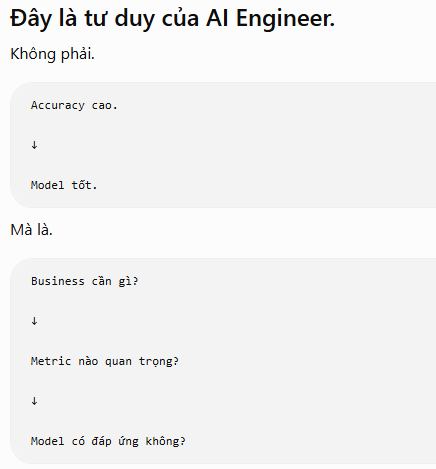

Đánh Giá Model sau test:

Accuracy: Sự chính xác ( dùng khi 2 class cân bằng accuracy_score )
Precision: Độ chính xác 
Recall: Nhớ lại
F1-score: 

-------------tư duy quan trọng nhất khi xây AI:-------------
"Đừng tối ưu một chỉ số trước khi hiểu chi phí của từng loại sai lầm.

Thực tế	        AI
---------------------------
Có bệnh         Có bệnh
Có bệnh         Có bệnh
Có bệnh         Không bệnh
Không bệnh      Có bệnh
Không bệnh      Không bệnh
Không bệnh      Không bệnh
Không bệnh      Không bệnh
Không bệnh      Không bệnh
Không bệnh      Không bệnh
Không bệnh      Không bệnh

|              | Thực tế Có | Thực tế Không |
| ------------ | ---------: | ------------: |
| **AI Có**    |          2 |             1 |
| **AI Không** |          1 |             6 |

 --------------------------------------------------
| True Positive (TP)    |      False Positive (FP) |
|-----------------------|--------------------------|
| False Negative (FN)   |       True Negative (TN) |
 --------------------------------------------------

1.  Trong tất cả bệnh nhân. AI đoán đúng bao nhiêu? ( nghĩa là số lượng đoán đúng / tổng số bệnh nhân) Dùng khi 2 Class 0 1 equal
            Accuracy = (TP + TN) / (TP + TN + FP + FN)

2.  Trong tất cả những người thực sự có bệnh. AI tìm được bao nhiêu?
            Recall = TP / (TP + FN)   
            <!-- Recall nhìn cột -->
            <!-- False Negative rất nguy hiểm. Thà báo nhầm còn hơn bỏ sót -->

3.  Trong tất cả những người AI nói có bệnh. Có bao nhiêu thực sự có bệnh? ( nghĩa là AI dự đoán số lượng đúng có bệnh / tổng số lượng AI nó có bệnh)
            Precision = TP / (TP + FP)
            <!-- Precision nhìn hàng -->
            <!-- Khi nào quan tâm Precision? -->
            <!-- Khi False Positive rất đắt. -->
            <!-- Bạn không muốn kết luận nhầm. -->
            Ví dụ:  AI khóa tài khoản ngân hàng.
                    AI kết luận gian lận.
                    AI gửi cảnh sát.

4.  
            F1-score: F1 thích sự cân bằng.

            F1=Precision+Recall2×Precision×Recall​

| Metric               | Câu hỏi                                 | Khi nào dùng             |
| -------------------- | --------------------------------------- | ------------------------ |
| **Confusion Matrix** | AI nhầm ai?                             | **Luôn nhìn đầu tiên**   |
| **Accuracy**         | Đoán đúng bao nhiêu?                    | Dataset cân bằng         |
| **Precision**        | AI nói "Có" thì đáng tin không?         | False Positive nguy hiểm |
| **Recall**           | AI có bỏ sót người cần phát hiện không? | False Negative nguy hiểm |
| **F1**               | Precision và Recall có cân bằng không?  | Muốn đánh giá tổng thể   |

Thứ tự đánh giá:

Bước 1 Confusion Matrix
↓
AI đang nhầm ai?
↓
Bước 2 Precision
↓
Có báo nhầm nhiều không?
↓
Bước 3 Recall
↓
Có bỏ sót nhiều không?
↓
Bước 4 F1
↓
Có cân bằng không?
↓
Cuối cùng mới nhìn Accuracy.

                                        Một framework.
Không có model nào tốt. Chỉ có.
                ----->  Model phù hợp Business.

Bước 1: Business sợ điều gì?
        - False Positive? ( precision )
        - False Negative? ( recall )
Bước 2: Chọn metric:
        - Nếu sợ bỏ sót => Ưu tiên Recall_score
        - Nếu sợ báo nhầm => Ưu tiên Precision_score
        - Nếu Dataset cân bằng => Accuracy_score
        

